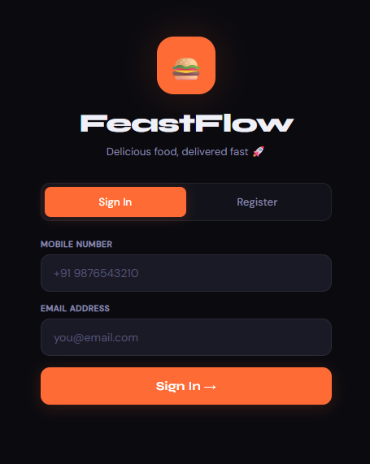
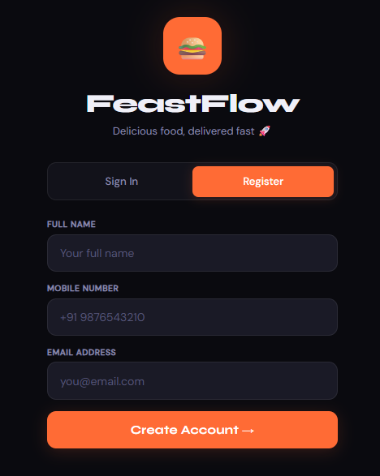
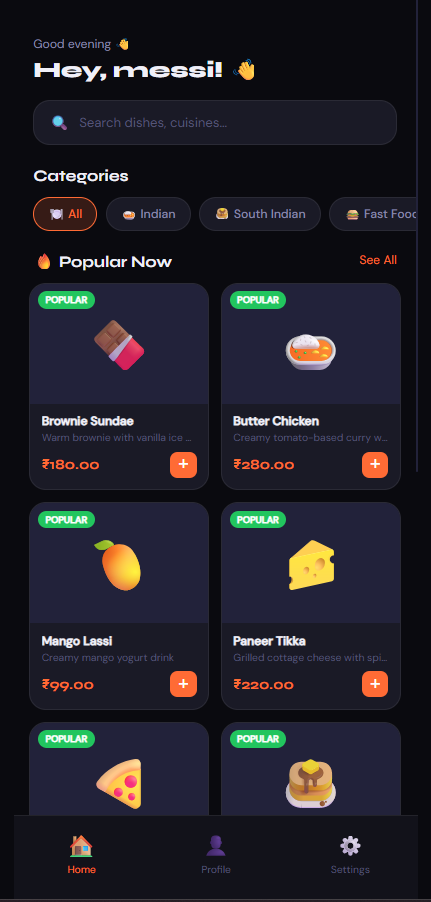
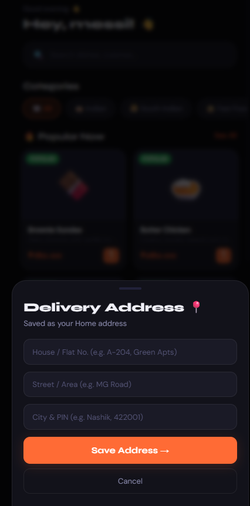
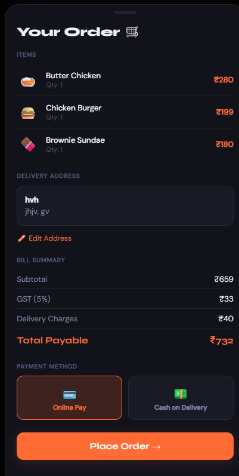
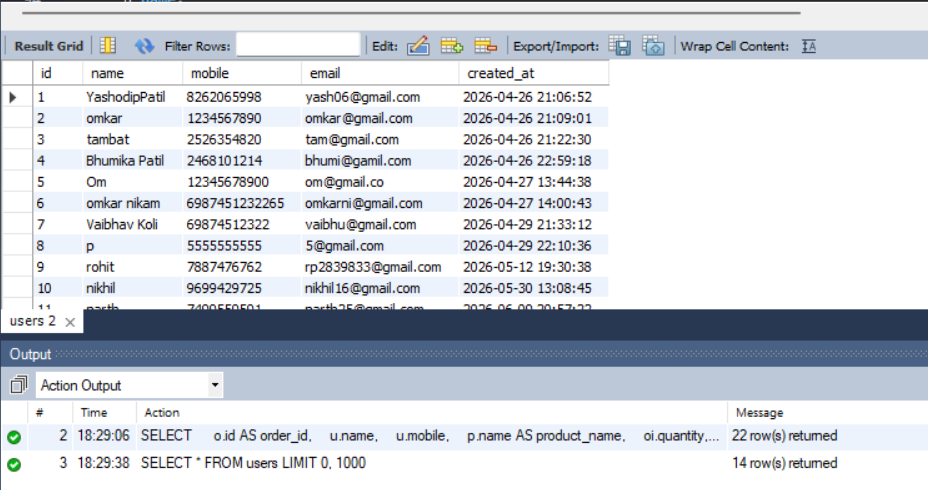
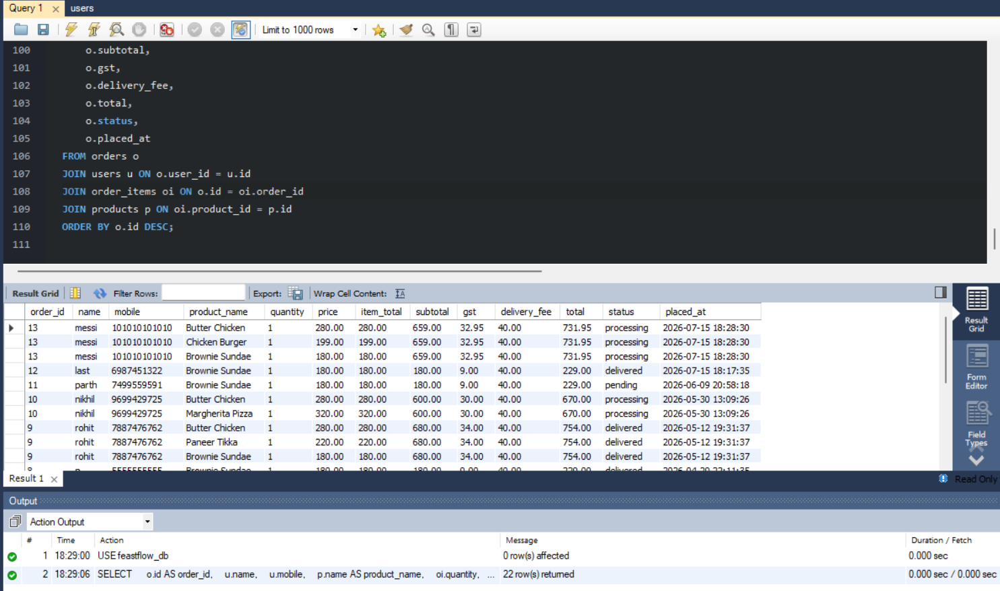

# 🍔 FeastFlow - Food Ordering System

FeastFlow is a modern full-stack food ordering web application built using **HTML, CSS, JavaScript, Node.js, Express.js, and MySQL**. It allows users to browse food items, create an account, log in, manage delivery addresses, place orders, and view their order history through a responsive and user-friendly interface.

---

## 📌 Features

- 🔐 User Registration & Login
- 🍽️ Browse Food Menu
- 🔍 Search Food Items
- 📂 Browse Food Categories
- 🛒 Shopping Cart
- 📍 Manage Delivery Addresses
- 💳 Multiple Payment Options (Online Payment & Cash on Delivery)
- 📦 Place Orders
- 📜 View Order History
- 🌙 Modern Dark-Themed User Interface
- 📱 Fully Responsive Design
- 🗄️ MySQL Database Integration

---

## 🛠️ Tech Stack

### Frontend
- HTML5
- CSS3
- JavaScript

### Backend
- Node.js
- Express.js

### Database
- MySQL

---

## 📂 Project Structure

```text
FeastFlow
│
├── backend/
│   ├── server.js
│   ├── package.json
│   └── package-lock.json
│
├── frontend/
│   └── index.html
│
├── feastflow_db.sql
│
├── login.png
├── register.png
├── home.png
├── address.png
├── checkout.png
├── database-users.png
├── database-orders.png
│
└── README.md
```

---

## 🗃️ Database Tables

The MySQL database consists of the following tables:

- Users
- Addresses
- Products
- Orders
- Order Items

---

## 📋 Prerequisites

Before running this project, make sure the following software is installed:

- Node.js
- npm (comes with Node.js)
- MySQL Server

---

## 🚀 Installation

### 1. Clone the Repository

```bash
git clone https://github.com/yashodippatil25-cloud/FeastFlow.git
```

### 2. Navigate to the Project Directory

```bash
cd FeastFlow
```

### 3. Install Backend Dependencies

```bash
cd backend
npm install
```

### 4. Start the Backend Server

```bash
node server.js
```

The server will start at:

```text
http://localhost:3001
```

### 5. Import the Database

Import the **feastflow_db.sql** file into your MySQL database.

### 6. Run the Application

Open **frontend/index.html** in your preferred web browser.

> **Note:** Make sure the backend server is running and MySQL is connected before using the application.

---

## 📷 Screenshots

### 🔐 Login Page

Secure login using a registered mobile number and email address.



---

### 📝 Register Page

Create a new account by entering your name, mobile number, and email address.



---

### 🏠 Home Page

Browse food categories, search for dishes, and explore popular menu items.



---

### 📍 Delivery Address

Add and manage delivery addresses before placing an order.



---

### 🛒 Checkout Page

Review your order, verify the delivery address, choose a payment method, and place the order.



---

### 🗄️ Users Table (MySQL)

Stores user registration details securely in the MySQL database.



---

### 📦 Orders Table (MySQL)

Stores order information, purchased items, quantities, prices, and order status.



---

## ✨ Future Enhancements

- OTP-Based Authentication
- Online Payment Gateway Integration (Razorpay/Stripe)
- Admin Dashboard
- Restaurant Management Panel
- Real-Time Order Tracking
- Email Notifications
- User Profile Management
- Order Status Updates

---

## 👨‍💻 Author

**Yashodip Patil**

GitHub:  
https://github.com/yashodippatil25-cloud

If you have any suggestions or feedback, feel free to open an issue or contribute to this project.

---

## ⭐ Support

If you found this project helpful, please consider giving it a ⭐ on GitHub.

Thank you for visiting the repository!
